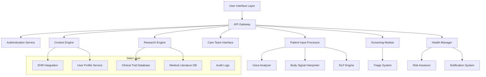

# Design Document: Vaidyah (Medical Copilot System)

## Overview

Vaidyah (Sanskrit: वैद्य, meaning "physician" or "healer") is a sophisticated AI-powered healthcare assistant built for the AWS AI for Bharat Hackathon. The system combines natural language processing, emotional intelligence, and comprehensive medical knowledge to bridge the communication gap between patients and healthcare providers, with special consideration for India's diverse linguistic and cultural healthcare landscape. The system employs a microservices architecture with specialized components for input processing, context analysis, care team communication, and personalized health management.

The design emphasizes narrative medicine principles, ensuring that patient stories and experiences are captured holistically rather than just clinical data points. The system is built to handle the complexity and contradictions inherent in medical information while maintaining the highest standards of privacy, security, and clinical accuracy.

## AWS Infrastructure and Deployment

Vaidyah leverages AWS services for scalable, secure, and cost-effective deployment:

### Core AWS Services
- **Amazon Bedrock**: Foundation models for medical NLP and analysis
- **Amazon Comprehend Medical**: Medical entity extraction and relationship detection
- **Amazon Transcribe Medical**: Speech-to-text with medical terminology support
- **Amazon Translate**: Multilingual support for Indian languages
- **Amazon Polly**: Text-to-speech for accessibility features
- **AWS Lambda**: Serverless compute for microservices
- **Amazon API Gateway**: RESTful API management and security
- **Amazon DynamoDB**: NoSQL database for patient profiles and interactions
- **Amazon S3**: Secure storage for medical documents and audio files
- **Amazon CloudWatch**: Monitoring, logging, and alerting
- **AWS KMS**: Encryption key management for HIPAA compliance
- **Amazon Cognito**: User authentication and authorization
- **AWS HealthLake**: FHIR-compliant healthcare data storage (optional)

### Regional Considerations for India
- **Mumbai Region (ap-south-1)**: Primary deployment for low latency
- **Multi-AZ Deployment**: High availability across availability zones
- **CloudFront CDN**: Fast content delivery across India
- **Route 53**: DNS management with health checks

## Architecture

The system follows a modular, event-driven architecture with the following key principles:

- **Separation of Concerns**: Each component has a distinct responsibility
- **Scalability**: Microservices can be scaled independently based on demand
- **Reliability**: Redundancy and failover mechanisms ensure high availability
- **Security**: End-to-end encryption and HIPAA compliance throughout
- **Interoperability**: Standard healthcare data formats (HL7, FHIR) for integration

### High-Level Architecture



## Components and Interfaces

### 1. Patient Input Processor

**Responsibility**: Processes and analyzes patient voice and text input to extract medical information and emotional context.

**Key Interfaces**:
- `processVoiceInput(audioData: AudioStream) -> ProcessedInput`
- `processTextInput(text: string) -> ProcessedInput`
- `analyzeEmotionalContext(input: ProcessedInput) -> EmotionalAnalysis`

**Internal Components**:
- **Voice Analyzer**: Processes speech-to-text conversion, prosody analysis, and emotional tone detection
- **Body Signal Interpreter**: Analyzes physiological signals when available (heart rate, blood pressure, etc.)
- **NLP Engine**: Extracts medical concepts, symptoms, and relationships from text

### 2. Context Engine

**Responsibility**: Integrates patient input with historical data, demographics, and environmental factors to provide comprehensive context.

**Key Interfaces**:
- `integrateContext(input: ProcessedInput, patientId: string) -> ContextualAnalysis`
- `detectContradictions(currentData: PatientData, historicalData: PatientHistory) -> ContradictionReport`
- `assessRiskFactors(context: ContextualAnalysis) -> RiskAssessment`

**Integration Points**:
- EHR systems via HL7/FHIR APIs
- User profile database
- Environmental data services (weather, air quality, etc.)

### 3. Care Team Interface

**Responsibility**: Generates structured summaries and reports for healthcare providers with appropriate prioritization.

**Key Interfaces**:
- `generateSummary(analysis: ContextualAnalysis) -> MedicalSummary`
- `prioritizeCase(summary: MedicalSummary) -> PriorityLevel`
- `formatForProvider(summary: MedicalSummary, providerType: ProviderType) -> FormattedReport`

### 4. Screening Module and Triage System

**Responsibility**: Conducts automated screening and assigns urgency levels for efficient care delivery.

**Key Interfaces**:
- `conductScreening(symptoms: SymptomList) -> ScreeningResult`
- `assignTriage(screening: ScreeningResult) -> TriageLevel`
- `generateQuestions(currentResponses: ResponseSet) -> AdaptiveQuestions`

### 5. Research Engine

**Responsibility**: Provides access to medical literature and clinical trial information with natural language querying.

**Key Interfaces**:
- `searchLiterature(query: string, filters: SearchFilters) -> ResearchResults`
- `findClinicalTrials(condition: string, demographics: Demographics) -> TrialResults`
- `summarizeFindings(research: ResearchResults) -> PlainEnglishSummary`

### 6. Health Manager

**Responsibility**: Provides personalized health recommendations and monitoring based on individual risk profiles.

**Key Interfaces**:
- `createUserProfile(medicalHistory: MedicalHistory) -> UserProfile`
- `calculateRiskProfile(profile: UserProfile) -> RiskProfile`
- `generateRecommendations(profile: UserProfile, currentHealth: HealthStatus) -> Recommendations`
- `scheduleNotifications(profile: UserProfile, recommendations: Recommendations) -> NotificationSchedule`

## Data Models

### Core Data Structures

```typescript
interface ProcessedInput {
  id: string;
  timestamp: Date;
  patientId: string;
  inputType: 'voice' | 'text';
  rawContent: string;
  extractedSymptoms: Symptom[];
  emotionalAnalysis: EmotionalAnalysis;
  confidence: number;
}

interface Symptom {
  name: string;
  severity: number; // 1-10 scale
  duration: string;
  onset: Date;
  location?: BodyLocation;
  qualifiers: string[];
}

interface EmotionalAnalysis {
  stressLevel: number; // 1-10 scale
  anxietyIndicators: string[];
  depressionMarkers: string[];
  voiceProsody?: ProsodyAnalysis;
  overallMood: 'positive' | 'neutral' | 'negative' | 'distressed';
}

interface ContextualAnalysis {
  patientId: string;
  currentSymptoms: Symptom[];
  relevantHistory: MedicalEvent[];
  riskFactors: RiskFactor[];
  contradictions: Contradiction[];
  environmentalFactors: EnvironmentalFactor[];
  confidence: number;
}

interface MedicalSummary {
  id: string;
  patientId: string;
  timestamp: Date;
  chiefComplaint: string;
  symptomProgression: SymptomProgression[];
  relevantHistory: string[];
  riskAssessment: RiskAssessment;
  recommendedActions: RecommendedAction[];
  priorityLevel: PriorityLevel;
  contradictions: Contradiction[];
}

interface UserProfile {
  patientId: string;
  demographics: Demographics;
  medicalHistory: MedicalHistory;
  currentConditions: Condition[];
  medications: Medication[];
  allergies: Allergy[];
  preferences: UserPreferences;
  riskProfile: RiskProfile;
}

interface ClinicalTrial {
  nctId: string;
  title: string;
  condition: string;
  phase: string;
  status: 'recruiting' | 'active' | 'completed' | 'suspended';
  eligibilityCriteria: EligibilityCriteria;
  location: Location[];
  contactInfo: ContactInfo;
  summary: string;
}
```

### Security and Privacy Models

```typescript
interface EncryptedPatientData {
  encryptedData: string;
  encryptionKey: string;
  accessLog: AccessLogEntry[];
  consentStatus: ConsentStatus;
}

interface AccessLogEntry {
  userId: string;
  timestamp: Date;
  action: 'read' | 'write' | 'delete' | 'share';
  dataType: string;
  purpose: string;
}
```

## Correctness Properties

*A property is a characteristic or behavior that should hold true across all valid executions of a system—essentially, a formal statement about what the system should do. Properties serve as the bridge between human-readable specifications and machine-verifiable correctness guarantees.*

### Property 1: Comprehensive Input Processing
*For any* patient input (voice or text), the Patient_Input_Processor should extract all medical concepts, analyze emotional context, and generate a structured symptom report with confidence scores
**Validates: Requirements 1.1, 1.2, 1.6**

### Property 2: Emotional Distress Detection and Flagging
*For any* voice input containing emotional distress indicators, the system should flag the input for priority attention and escalate appropriately
**Validates: Requirements 1.4**

### Property 3: Physiological Signal Correlation
*For any* available body signal data and reported symptoms, the Body_Signal_Interpreter should identify and document correlations between physiological measurements and patient-reported symptoms
**Validates: Requirements 1.5**

### Property 4: Comprehensive Context Integration
*For any* patient input, the Context_Engine should retrieve relevant medical history, incorporate demographic and environmental factors, and generate a complete contextual analysis
**Validates: Requirements 2.1, 2.2, 2.3, 2.4, 2.6**

### Property 5: Contradiction Detection and Flagging
*For any* contradictory information in patient data, the Context_Engine should detect inconsistencies, flag them appropriately, and request clarification
**Validates: Requirements 2.5**

### Property 6: Structured Medical Summary Generation
*For any* completed patient assessment, the Care_Team_Interface should generate a structured medical summary that includes all required clinical elements and follows documentation standards
**Validates: Requirements 3.1, 3.3, 3.6**

### Property 7: Priority-Based Case Flagging
*For any* urgent or critical medical conditions detected, the Care_Team_Interface should assign appropriate priority levels and flag cases for immediate attention
**Validates: Requirements 3.2**

### Property 8: Chronological Progression Tracking
*For any* series of patient interactions, the Care_Team_Interface should maintain chronological order and provide progression summaries that show symptom evolution over time
**Validates: Requirements 3.4**

### Property 9: Discrepancy Highlighting
*For any* contradictions in patient data, the Care_Team_Interface should highlight discrepancies in provider reports for clinical review
**Validates: Requirements 3.5**

### Property 10: Automated Screening and Adaptive Questioning
*For any* patient contact, the Screening_Module should conduct symptom screening with questions that adapt based on patient responses
**Validates: Requirements 4.1, 4.4**

### Property 11: Severity-Based Triage Assignment
*For any* completed screening, the Triage_System should assign urgency levels that accurately reflect symptom severity and provide appropriate wait times and next steps
**Validates: Requirements 4.2, 4.5**

### Property 12: Emergency Protocol Escalation
*For any* high-risk symptoms detected during screening, the Triage_System should immediately escalate to emergency protocols without delay
**Validates: Requirements 4.3**

### Property 13: Misdiagnosis Risk Detection
*For any* screening that identifies potential misdiagnosis risks, the Screening_Module should flag cases for specialist review with appropriate documentation
**Validates: Requirements 4.6**

### Property 14: Comprehensive Medical Literature Search
*For any* provider query, the Research_Engine should search medical databases comprehensively and provide plain English summaries of relevant clinical findings
**Validates: Requirements 5.1, 5.2**

### Property 15: Demographic-Based Research Filtering
*For any* research query with demographic filters, the Research_Engine should return results that match the specified criteria (age, race, gender, condition)
**Validates: Requirements 5.3**

### Property 16: Clinical Trial Identification and Validation
*For any* relevant medical condition, the Research_Engine should identify ongoing clinical trials, verify information currency, and highlight key treatment options
**Validates: Requirements 5.4, 5.5, 5.6**

### Property 17: Patient-Trial Matching
*For any* patient search for clinical trials, the Clinical_Trial_Database should return trials that match the patient's condition and demographics with appropriate ranking
**Validates: Requirements 6.1, 6.5**

### Property 18: Plain English Trial Information
*For any* clinical trial information presented, the Research_Engine should provide eligibility criteria and informed consent information in plain English
**Validates: Requirements 6.2, 6.6**

### Property 19: Current Trial Status and Historical Data
*For any* trial query, the Research_Engine should provide current enrollment status for ongoing trials and include historical trial results from 2000 onwards
**Validates: Requirements 6.3, 6.4**

### Property 20: Comprehensive User Profile Creation
*For any* new user, the Health_Manager should collect complete medical history and preferences to create a comprehensive user profile
**Validates: Requirements 7.1**

### Property 21: Personalized Risk Assessment
*For any* available health data, the Risk_Assessor should calculate accurate personalized risk profiles and provide evidence-based lifestyle recommendations
**Validates: Requirements 7.2, 7.6**

### Property 22: Timely Preventive Care Notifications
*For any* preventive measures that become due, the Notification_System should send timely reminders for screenings and checkups
**Validates: Requirements 7.3**

### Property 23: Real-Time Health Data Integration
*For any* available wearable data, the Health_Manager should integrate real-time physiological monitoring and update risk assessments when factors change
**Validates: Requirements 7.4, 7.5**

### Property 24: Comprehensive Security Implementation
*For any* patient data operation (storage, transmission, access), the Medical_Copilot should implement encryption, secure protocols, multi-factor authentication, and maintain comprehensive audit logs
**Validates: Requirements 8.1, 8.2, 8.3, 8.6**

### Property 25: Consent-Based Data Sharing
*For any* data sharing request, the Medical_Copilot should require explicit patient consent before allowing access to personal health information
**Validates: Requirements 8.4**

### Property 26: Breach Detection and Response
*For any* detected data breach, the Medical_Copilot should immediately notify affected users and authorities according to regulatory requirements
**Validates: Requirements 8.5**

### Property 27: Healthcare System Interoperability
*For any* integration with healthcare systems, the Medical_Copilot should support standard data formats (HL7, FHIR), validate imported data, and format exports according to receiving system requirements
**Validates: Requirements 9.1, 9.2, 9.3**

### Property 28: API Availability and Data Consistency
*For any* real-time integration need, the Medical_Copilot should provide functional API endpoints and maintain data consistency across all integrated systems
**Validates: Requirements 9.4, 9.5**

### Property 29: Integration Error Handling
*For any* integration errors, the Medical_Copilot should log errors comprehensively and provide fallback data access methods
**Validates: Requirements 9.6**

### Property 30: Comprehensive Accessibility Support
*For any* user with disabilities, the Medical_Copilot should provide appropriate accessibility features (screen reader compatibility, text-based communication, visual indicators) that comply with WCAG 2.1 AA standards
**Validates: Requirements 10.1, 10.2, 10.5**

### Property 31: Multilingual Support with Medical Accuracy
*For any* user speaking different languages, the Medical_Copilot should provide real-time translation that maintains medical terminology accuracy across languages
**Validates: Requirements 10.3, 10.6**

### Property 32: Cultural Communication Adaptation
*For any* cultural context, the Medical_Copilot should adapt communication styles appropriately while maintaining clinical accuracy
**Validates: Requirements 10.4**

## Error Handling

The Medical Copilot System implements comprehensive error handling strategies across all components:

### Input Processing Errors
- **Speech Recognition Failures**: Fallback to text input with clear user guidance
- **Medical Concept Extraction Errors**: Confidence scoring with human review triggers
- **Emotional Analysis Uncertainties**: Multiple analysis methods with consensus scoring

### Context Integration Errors
- **Missing Historical Data**: Graceful degradation with available information
- **Contradictory Information**: Explicit flagging with clarification requests
- **Integration Failures**: Cached data access with error logging

### Care Team Communication Errors
- **Summary Generation Failures**: Template-based fallback summaries
- **Priority Assignment Errors**: Conservative escalation with manual review
- **Format Compliance Issues**: Standard format enforcement with validation

### Security and Privacy Errors
- **Authentication Failures**: Multi-factor backup methods with security logging
- **Encryption Errors**: Immediate data isolation with security team notification
- **Breach Detection**: Automated response protocols with regulatory compliance

### System Integration Errors
- **EHR Connection Failures**: Local data access with synchronization queuing
- **API Endpoint Errors**: Circuit breaker patterns with graceful degradation
- **Data Validation Failures**: Quarantine with manual review processes

## Testing Strategy

The Medical Copilot System employs a dual testing approach combining unit tests for specific scenarios and property-based tests for comprehensive validation:

### Unit Testing Focus
- **Specific Medical Scenarios**: Test known medical conditions and expected responses
- **Edge Cases**: Handle unusual input patterns and boundary conditions
- **Integration Points**: Verify component interactions and data flow
- **Error Conditions**: Validate error handling and recovery mechanisms
- **Security Scenarios**: Test authentication, authorization, and data protection

### Property-Based Testing Configuration
- **Testing Framework**: Hypothesis (Python) for comprehensive property validation
- **Test Iterations**: Minimum 100 iterations per property test for statistical confidence
- **Data Generation**: Medical-domain-specific generators for realistic test data
- **Property Validation**: Each correctness property implemented as a separate test
- **Test Tagging**: Format: **Feature: medical-copilot, Property {number}: {property_text}**

### Testing Coverage Requirements
- **Functional Coverage**: All acceptance criteria validated through corresponding properties
- **Security Coverage**: All security requirements tested with both positive and negative cases
- **Performance Coverage**: Response time and throughput validation under load
- **Accessibility Coverage**: All accessibility features tested with assistive technologies
- **Integration Coverage**: All external system integrations validated end-to-end

### Medical Domain Testing Considerations
- **Clinical Accuracy**: Validation against medical literature and clinical guidelines
- **Regulatory Compliance**: HIPAA, FDA, and other healthcare regulation adherence
- **Safety Critical**: Extra validation for emergency and high-risk scenarios
- **Privacy Protection**: Comprehensive testing of data protection mechanisms
- **Interoperability**: Validation with multiple EHR systems and healthcare standards

The testing strategy ensures that the Medical Copilot System meets the highest standards of clinical accuracy, patient safety, and regulatory compliance while maintaining robust performance under real-world healthcare conditions.